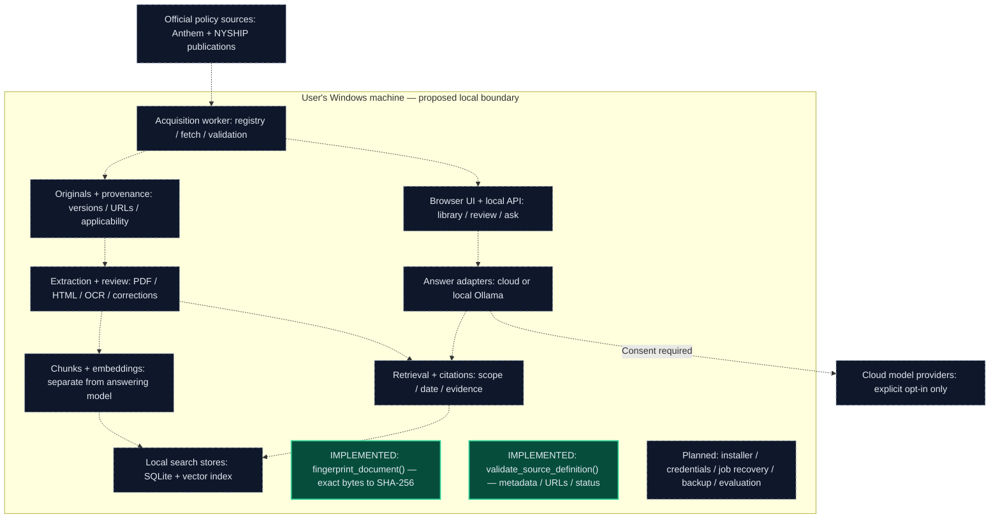

# PayerPolicy — System Architecture

**Windows-first · Empire Plan Hospital Program · Phase 1, increment 2**

Content fingerprinting and source-definition validation are implemented.
Everything else in the system diagram is planned. The foundation functions
are not yet connected to storage or downloading.

This Markdown version uses Mermaid for diagram rendering on GitHub and in
Mermaid-enabled Markdown viewers. The component table below remains readable
in any Markdown viewer. The [original HTML diagram](architecture.html) is
retained as an offline snapshot; this Markdown document is the maintained view.

## System diagram

All arrows show **proposed**, not implemented, connections.

**Legend:** Green nodes are implemented functions. Dashed nodes and arrows
represent planned components and data flow. The Windows boundary is proposed;
it does not imply that a packaged application exists.

## Component status

| Component | Responsibility | Status |
|---|---|---|
| `fingerprint_document()` | Fingerprint exact document bytes using SHA-256 | Implemented and unit-tested |
| `validate_source_definition()` | Check source metadata, URLs, and applicability status | Implemented and unit-tested |
| Official policy sources | Anthem and NYSHIP publications | Integration planned |
| Acquisition worker | Source registry, fetching, and download validation | Planned |
| Browser UI + local API | Library browsing, document review, and questions | Planned |
| Originals + provenance | Original documents, versions, source URLs, and applicability | Planned |
| Extraction + review | PDF/HTML processing, OCR, and corrections | Planned |
| Chunks + embeddings | Prepare searchable content independently of the answering model | Planned |
| Local search stores | SQLite and an embedded vector index | Planned |
| Retrieval + citations | Scope/date filtering and supporting evidence | Planned |
| Answer adapters | Connect local Ollama or cloud models | Planned |
| Cloud model providers | Optional external inference with explicit consent | Planned |
| Cross-cutting services | Installer, credentials, job recovery, backup, and evaluation | Planned |

## Implemented now

Two pure functions with no external dependencies:

- **Document fingerprints:** identify identical content, not authenticity.
- **Source-definition validation:** check structure without verifying source
  authority or actual policy applicability.

Neither function downloads documents, accesses a database, or calls a model.

## Next small increment

A registry loader and one reviewed official source entry. No automatic
downloads until network and applicability boundaries are tested.

## Trust boundary

- Documents are untrusted evidence, never executable instructions.
- Cloud transmission requires consent.
- General Anthem policy is not automatically Empire Plan policy.
- Embeddings remain separate from the answering model.

## Related documentation

- [Delivery plan](implementation-plan.md)
- [Source-definition contract](source-definition.md)
- [Project README](../README.md)
