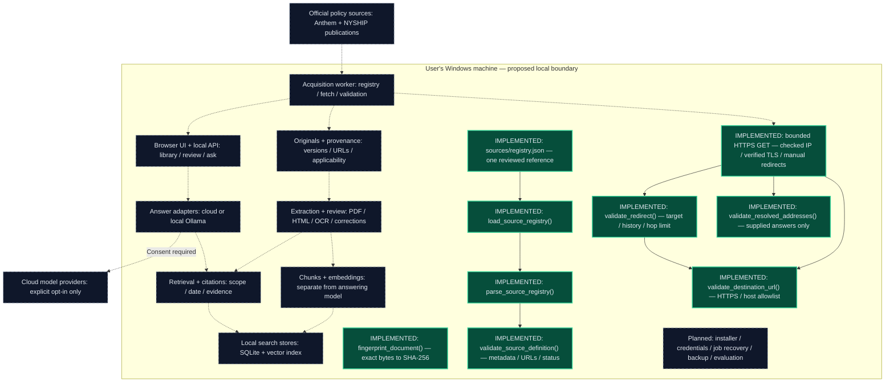

# PayerPolicy — System Architecture

**Windows-first · Empire Plan Hospital Program · Phase 1, increment 5**

Content fingerprinting, source validation, JSON parsing, and local registry
loading are implemented. Offline URL, resolved-address, and redirect/history
checks are implemented too. A bounded checked-address HTTPS GET building block
now uses these checks; one reviewed reference entry is checked in. Document
storage, an automatic acquisition worker, and the rest of the pipeline remain
planned.

This Markdown version uses Mermaid for diagram rendering on GitHub and in
Mermaid-enabled Markdown viewers. The component table below remains readable
in any Markdown viewer. The [original HTML diagram](architecture.html) is
retained as an offline snapshot; this Markdown document is the maintained view.

## System diagram

Solid arrows show implemented local loading/calls. Dashed arrows show proposed
pipeline connections.

**Legend:** Green nodes are implemented functions or checked-in data. Dashed nodes and arrows
represent planned components and data flow. The Windows boundary is proposed;
it does not imply that a packaged application exists.

## Component status

| Component | Responsibility | Status |
|---|---|---|
| `fingerprint_document()` | Fingerprint exact document bytes using SHA-256 | Implemented and unit-tested |
| `validate_source_definition()` | Check source metadata, URLs, and applicability status | Implemented and unit-tested |
| `parse_source_registry()` | Strict JSON parsing and whole-registry validation | Implemented and tested |
| `load_source_registry()` | Read a local UTF-8 registry | Implemented and tested |
| `sources/registry.json` | One reviewed Anthem overview; reference only | Checked in and load-tested |
| `validate_destination_url()` | Exact reviewed HTTPS host/port and raw URL checks | Implemented and offline-tested |
| `validate_resolved_addresses()` | Reject a whole supplied answer set if any address is unsafe | Implemented and offline-tested; does not resolve DNS |
| `validate_redirect()` | Recheck target, caller history, loops, and hop limit | Implemented and offline-tested; does not follow redirects |
| Checked-address HTTPS GET | DNS-answer validation, pinned numeric TCP, verified TLS, manual redirects, bounded body | Implemented; offline unit tests and local TLS test, no public fetch verified |
| Official policy sources | Anthem and NYSHIP publications | Integration planned |
| Acquisition worker | Source registry, fetching, and download validation | Planned |
| Browser UI + local API | Library browsing, document review, and questions | Planned |
| Originals + provenance | Original documents, versions, source URLs, and applicability | Planned |
| Extraction + review | PDF/HTML processing, OCR, and corrections | Planned |
| Chunks + embeddings | Prepare searchable content independently of the answering model | Planned |
| Local search stores | SQLite and an embedded vector index | Planned |
| Retrieval + citations | Scope/date filtering and supporting evidence | Planned |
| Answer adapters | Connect local Ollama or cloud models | Planned |
| Cloud model providers | Optional external inference with explicit consent | Planned |
| Cross-cutting services | Installer, credentials, job recovery, backup, and evaluation | Planned |

## Implemented now

Foundation components with no external dependencies:

- **Document fingerprints:** identify identical content, not authenticity.
- **Source-definition validation:** check structure without verifying source
  authority or actual policy applicability.

- **Registry parsing:** rejects invalid content and duplicates atomically.
- **Local loading:** reads UTF-8 and preserves file/encoding errors.
- **Reference entry:** Anthem overview with a dated review note.
- **Network-safety helpers:** pure checks for reviewed URL destinations, complete
  caller-supplied addresses, and redirects. See the
  [contract and exclusions](network-safety.md).
- **Checked-address HTTPS GET:** calls those helpers, resolves each request,
  pins the selected address, verifies hostname TLS identity, and bounds bytes
  in memory. It has no reviewed live-source integration. See the
  [transport contract](https-transport.md).

Only the loader reads a local file. The transport can perform one reviewed-host
HTTPS GET when called, but the source registry does not call it. No component
stores retrieved policies, accesses a database, or calls a model.

## Next small increment

Scope and approve source-access review and document validation/storage before
building an acquisition worker. The transport does not check whether the host
permits automated access, whether bytes are a valid policy, or whether that
policy governs a particular benefit. It also lacks a hard DNS-resolution
or whole-request deadline. Keep these limits explicit in a future live test.

## Trust boundary

- Documents are untrusted evidence, never executable instructions.
- Cloud transmission requires consent.
- General Anthem policy is not automatically Empire Plan policy.
- Embeddings remain separate from the answering model.

## Related documentation

- [Delivery plan](implementation-plan.md)
- [Source-definition contract](source-definition.md)
- [Network-safety contract](network-safety.md)
- [HTTPS transport contract](https-transport.md)
- [Project README](../README.md)
